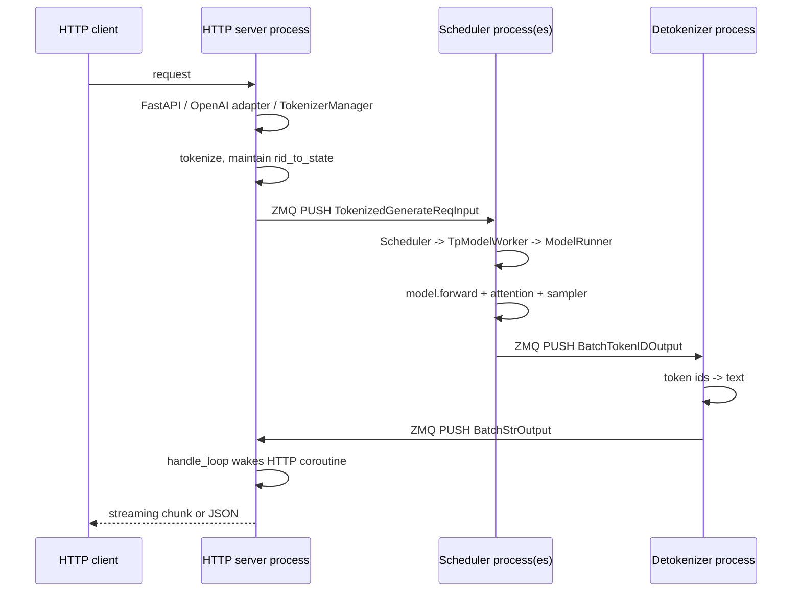
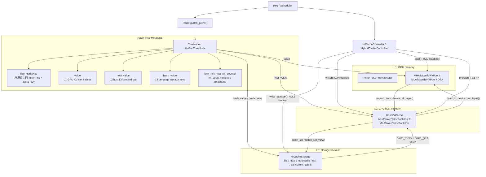
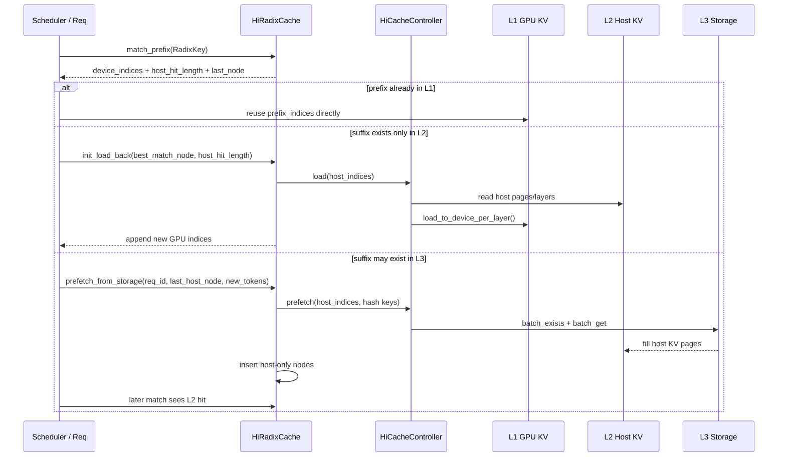

+++
title = "SGLang"
date = "2026-06-25"
+++

# 创新点
sglang 推理引擎很大的一个创新点就是引入了 radix tree，这个结构相比 prefix hash table 的好处是：
1. 更细粒度的匹配。因为 radix tree 按照 token 粒度索引，因此在匹配时可以做到尽可能地最大匹配。这相对于类似于 paged attention 成 block 的设计来说，可以做到更大程度复用 kvcache。
2. 拥有了树结构之后，父子节点，共同祖先的关系就显而易见，那这样连续的共同祖先节点就可以压缩成一个节点存储，对多轮请求的 fork 也可以天然支持，因为这等价于一个节点的分裂操作。
3. 有利于指导淘汰策略，比如每次都是在所有叶子节点中考虑淘汰谁，这样可以使得公共祖先尽可能地被保留，确保 kvcache 被最大程度复用。
4. 有利于指导调度策略，比如那些拥有最长公共前缀的请求可以被优先调度。当然如何防止那些最长公共前缀短的请求，也是 future work。

# 进程架构
sglang 对外呈现的是 http server，基于 FastAPI Web 框架实现。启动的 http server 主进程，其中有个 TokenizerManager 的角色，负责响应请求以及 tokenization，之后会把请求通过 ZMQ 传递给 Scheduler 进程，这是核心推理逻辑运行的模块。Scheduler 会根据配置的并行度，比如 tp_size, dp_size 和 pp_size 来 fork 多个子进程，tp 通常是绑定到不同的 GPU 上，pp 是模型层次之间的划分，通过流水线来实现并发，dp 等于多个 replica，每个 dp worker 有一份完整的模型权重，当 dp_size > 1 时，首先会 fork 出一个 DataParallelController 子进程，然后再由 DataParallelController fork 出多个 dp worker。当推理任务执行完后，结果会由 DeTokenizerManager 由 token-id 转为实际的 text。最后，统一交给 TokenizerManager 所在主进程响应用户请求。

## Scheduler
sglang 调度粒度是以 batch 进行的，batch 的大小是通过 max_running_requests 参数设置的，也就是每一轮允许同时处理的最大请求数量。

batch 的概念分为两种一个是 ScheduleBatch，一个是 ForwardBatch。ScheduleBatch 主要负责调度相关的信息，如用户请求状态，kvcache 管理，采样配置？logprobs?。ForwardBatch 主要负责模型推理相关的信息，如模型输入，模型输出，attention，sampler。ForwardBatch 通过 ScheduleBatch 中提供的信息进行初始化。Prefill 阶段每个请求的 input_ids 长度不尽相同，运算时会 flatten 成一个长序列，attention 运算时会 mask 掉请求边界之外的输入。Decode 阶段 running batch 中每个请求 token by token 产出，尽管每个请求 forward 计算时所需求的 kvcache 数量和上下文长度不同。

todo:
forward 计算时，不同请求 batch 怎么排布，如何跟 GPU 交互，这些需要再学习一下。

## KVCache

### Radix Tree Node 存什么

| 字段 | 含义 |
| --- | --- |
| `key: RadixKey` | 压缩 radix 边上的 token 片段，不是完整 prefix |
| `value` | GPU KV pool 里的 slot indices，也就是 L1 索引 |
| `host_value` | CPU host KV pool 里的 slot indices，也就是 L2 索引 |
| `hash_value` | 每个 page 的 storage hash key，用来访问 L3 |
| `children` / `parent` | radix tree 结构 |
| `lock_ref` / `host_ref_counter` | 防止被 GPU/host eviction |
| `last_access_time` / `hit_count` / `priority` | eviction、write-through/selective 策略用 |
| `write_through_pending_id` | 异步 D2H/H2L3 写入时保护节点 |

一个很重要的点：value 和 host_value 都不是 KV tensor 本体，只是 KV pool 的位置索引。KV 本体分别在 GPU pool 和 host pool 中。

如果是 hybrid/unified cache，比如 full attention + SWA + Mamba，节点变成 UnifiedTreeNode，见 python/sglang/srt/mem_cache/unified_radix_cache.py:78。它把不同组件的数据放到 component_data 里，每个组件有 value/
host_value/lock_ref/host_lock_ref，定义在 python/sglang/srt/mem_cache/unified_cache_components/tree_component.py:61。FULL/SWA/MAMBA 会各自构造 PoolTransfer，但整体 L1/L2/L3 抽象不变。

### 请求命中路径

