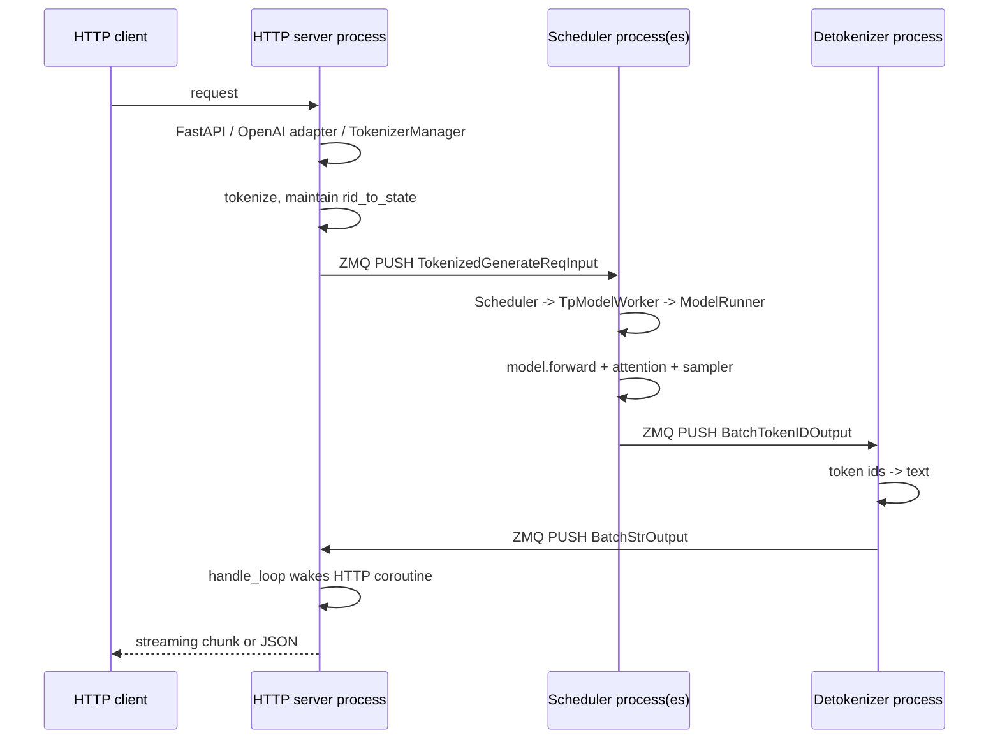

+++
title = "SGLang"
date = "2026-06-25"
+++

# 创新点
sglang 推理引擎很大的一个创新点就是引入了 radix tree，这个结构相比 prefix hash table 的好处是：
1. 更细粒度的匹配。因为 radix tree 按照 token 粒度索引，因此在匹配时可以做到尽可能地最大匹配。这相对于类似于 paged attention 成 block 的设计来说，可以做到更大程度复用 kvcache。
2. 拥有了树结构之后，父子节点，共同祖先的关系就显而易见，那这样连续的共同祖先节点就可以压缩成一个节点存储，对多轮请求的 fork 也可以天然支持，因为这等价于一个节点的分裂操作。
3. 有利于指导淘汰策略，比如每次都是在所有叶子节点中考虑淘汰谁，这样可以使得公共祖先尽可能地被保留，确保 kvcache 被最大程度复用。
4. 有利于指导调度策略，比如那些拥有最长公共前缀的请求可以被优先调度。当然如何防止那些最长公共前缀短的请求，也是 future work。

# 进程架构
sglang 对外呈现的是 http server，基于 FastAPI Web 框架实现。启动的 http server 主进程，其中有个 TokenizerManager 的角色，负责响应请求以及 tokenization，之后会把请求通过 ZMQ 传递给 Scheduler 进程，这是核心推理逻辑运行的模块。Scheduler 会根据配置的并行度，比如 tp_size, dp_size 和 pp_size 来 fork 多个子进程，tp 通常是绑定到不同的 GPU 上，pp 是模型层次之间的划分，通过流水线来实现并发，dp 等于多个 replica，每个 dp worker 有一份完整的模型权重，当 dp_size > 1 时，首先会 fork 出一个 DataParallelController 子进程，然后再由 DataParallelController fork 出多个 dp worker。当推理任务执行完后，结果会由 DeTokenizerManager 由 token-id 转为实际的 text。最后，统一交给 TokenizerManager 所在主进程响应用户请求。

